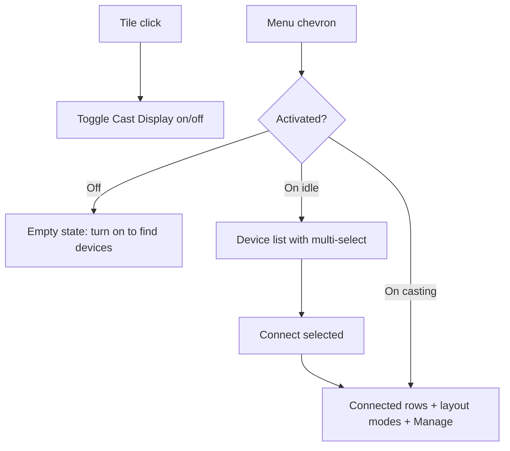

# Cast Display activation and multi-device UX

## Current vs target

Today [`ui/castDisplayMenu.js`](ui/castDisplayMenu.js) uses `toggleMode: false` (click opens menu), always shows Layout + Presentation + Cast list, and the helper only casts to **one** Chromecast at a time.

**Locked semantics**
- **Activate** = feature power (start helper / discovery readiness). Does **not** auto-connect.
- **Layout modes** (Mirror / Extend / Main only / Secondary only) stay Mutter local-monitor presets via [`lib/displayConfig.js`](lib/displayConfig.js); they appear **after** at least one device is connected (and inside Manage), not at the top of every menu.
- **Multi-device Chromecast** = one capture stream, same URL played on N receivers (helper HTTP path already multi-client). Miracast remains single-device via GND.
- **Presentation** = remove menu toggle; keep silent `cast-auto-presentation` on connect/disconnect.

## 1. Tile: click activates

In [`ui/castDisplayMenu.js`](ui/castDisplayMenu.js):

- Set `toggleMode: true` on `CastDisplayMenuToggle`.
- Persist activation in GSettings (new key `cast-display-enabled`, default `false`).
- **On**: `checked = true`, `ensureStarted()`, subtitle like `Ready` / `N displays found`, scan when menu opens.
- **Off**: stop any cast session, clear selection, `checked = false`, menu shows empty state only (no device list).
- `checked` while casting stays true; turning the tile **off** always disconnects.

Update menu header subtitle to something like “Find and connect displays” (drop “presentation”).

## 2. Menu when on: devices + multi-select

Rebuild the cast section as the **primary** menu content when activated:

| State | Menu content |
|-------|----------------|
| Off | Compact empty: “Cast Display is off” + hint to turn it on |
| On, idle | Device rows + Refresh + Connect CTA |
| On, connected | Connected block + layout/manage + optional “Add device” list |

**Device rows (idle)**
- Tap row toggles selection (checkbox/check style, compact for QS width).
- Single selected device: primary button **Connect**.
- Replace presentation switch with **Connect multiple** ([`_buildPresentationSwitch`](ui/castDisplayMenu.js) → new CTA): when pressed with 0–1 selected, enter/emphasize multi-select; with 2+ selected, connect all.
- Show protocol badge (Cast / Wireless display); Miracast selection is exclusive (cannot multi-select with Chromecast).
- Empty / helper-down states stay as today but only when **on**.

Scan still runs on `open-state-changed` **only if activated**.

## 3. After connect: features + Manage

When `casting` / `connecting`:

- Per connected device row: name, status, **Disconnect**, and a compact mode chip row (**Mirror** / **Extend** / **Main only** / **Secondary only**) calling existing `_runLayout`.
- **Manage** expandable block (replaces always-on Layout + Custom grouping at top):
  - **Mirror all** → `applyMirrorAll()` + ensure all connected Chromecasts share the stream.
  - **Group** → reuse existing monitor grouping UI when ≥3 local monitors; for ≥2 connected cast devices, simple group letters stored in settings (`cast-device-groups`) used to apply “mirror within group” intent (same stream already) and show which sinks are linked.
  - Per-device mode list if chips are too tight on the row (fallback: Manage lists each device + mode buttons).

Remove the always-visible top Layout grid and Presentation switch from `_init` build order; Display settings link stays at the bottom.

## 4. Helper + D-Bus: multi Chromecast

Extend [`helpers/cast-helper/cast_helper.py`](helpers/cast-helper/cast_helper.py) and [`lib/castService.js`](lib/castService.js):

- Track multiple active Chromecast sessions (`_active` → map/list); `stop()` stops all.
- New method `CastDevices(as device_ids, s source)`: start portal+pipeline once (if needed), `play_url` for each id; reject Miracast IDs in the array (UI opens GND only for single miracast).
- Optional `DisconnectDevice(s id)` to drop one sink without tearing down the stream if others remain.
- Status: keep `GetStatus` primary-friendly (`deviceName` like “Living Room + 2”); add `ListSessions` → `a(sss)` `(id, name, state)` for the UI, or pack multiple IDs in existing fields + UI refresh via `listDevices` + local selection state—prefer **`ListSessions`** for clarity.
- Update CAST_XML proxy in `castService.js` accordingly (`castDevices`, `listSessions`, `disconnectDevice`).

UI `_startCast` becomes `_startCastSelected(devices[])` calling `castDevices`.

## 5. Styles / responsiveness

Update [`stylesheet.css`](stylesheet.css) for:

- Compact device rows with selection indicator (`dac-cast-device-row`, selected state).
- Mode chip row that wraps / uses smaller min-heights (~26–28px) so the flyout stays usable.
- Manage section spacing consistent with existing `.dac-*` patterns (no Shell-private class names).

## 6. Docs touch

Brief README UX update: tile on/off, multi-connect, Manage; presentation is automatic while casting.

## Out of scope

- True “extend desktop onto Chromecast” virtual monitors (still roadmap).
- Multi Miracast sessions inside GND.
- Removing presentation **backend** (only the menu toggle).
