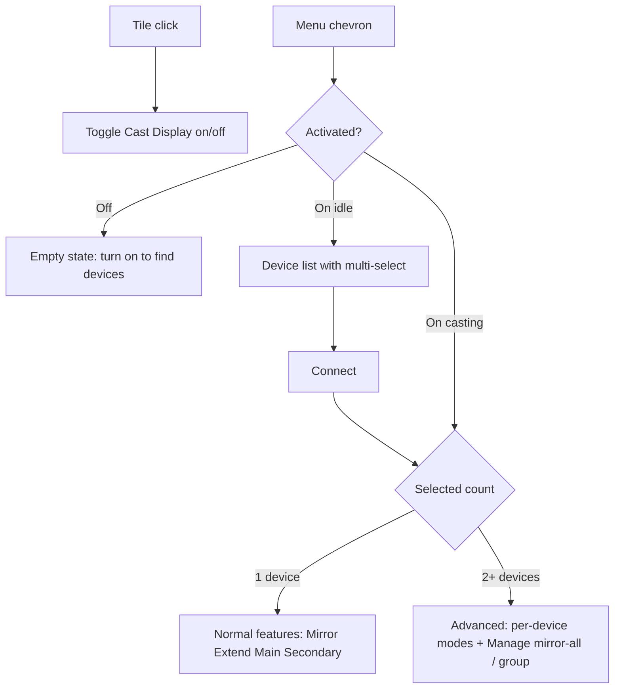

# Cast Display activation and multi-device UX

## Current vs target

Today [`ui/castDisplayMenu.js`](ui/castDisplayMenu.js) uses `toggleMode: false` (click opens menu), always shows Layout + Presentation + Cast list, and the helper only casts to **one** Chromecast at a time.

**Locked semantics**
- **Activate** = feature power (start helper / discovery readiness). Does **not** auto-connect.
- **Connect branching** = after Connect, UI depends on how many devices were selected:
  - **1 device** → show **normal** features only (Mirror / Extend / Main only / Secondary only) for that connection.
  - **2+ devices** → show **advanced** multi-device features (per-device modes + Manage: mirror all / group devices with a feature per connected device).
- **Layout modes** stay Mutter local-monitor presets via [`lib/displayConfig.js`](lib/displayConfig.js); they appear **after** connect (not at the top of every menu), gated by the branch above.
- **Multi-device Chromecast** = one capture stream, same URL played on N receivers (helper HTTP path already multi-client). Miracast remains single-device via GND.
- **Presentation** = remove menu toggle; keep silent `cast-auto-presentation` on connect/disconnect.

## 1. Tile: click activates

In [`ui/castDisplayMenu.js`](ui/castDisplayMenu.js):

- Set `toggleMode: true` on `CastDisplayMenuToggle`.
- Persist activation in GSettings (new key `cast-display-enabled`, default `false`).
- **On**: `checked = true`, `ensureStarted()`, subtitle like `Ready` / `N displays found`, scan when menu opens.
- **Off**: stop any cast session, clear selection, `checked = false`, menu shows empty state only (no device list).
- `checked` while casting stays true; turning the tile **off** always disconnects.

Update menu header subtitle to something like “Find and connect displays” (drop “presentation”).

## 2. Menu when on: devices + Connect

Rebuild the cast section as the **primary** menu content when activated:

| State | Menu content |
|-------|----------------|
| Off | Compact empty: “Cast Display is off” + hint to turn it on |
| On, idle | Device rows + Refresh + **Connect** CTA |
| On, connected (1) | Connected row + **normal** layout feature chips |
| On, connected (2+) | Connected rows + **advanced** per-device modes + Manage |

**Device rows (idle)**
- Tap row toggles selection (checkbox/check style, compact for QS width).
- One **Connect** button (not a separate “Connect multiple” primary action). Label can reflect count when useful (`Connect` vs `Connect (N)`).
- Replace the presentation switch slot with this Connect CTA (or keep Connect adjacent to the device list and use that slot for a short multi-select hint when 2+ are checked).
- Show protocol badge (Cast / Wireless display); Miracast selection is exclusive (cannot multi-select with Chromecast).
- Empty / helper-down states stay as today but only when **on**.

Scan still runs on `open-state-changed` **only if activated**.

## 3. After Connect: branch by selection count

Connect runs `_startCastSelected(selectedDevices)`. After a successful connect (and while sessions remain), rebuild the feature area from selection/session count:

### Normal features (exactly 1 connected / selected device)

- Connected row: name, status, **Disconnect**.
- Compact chip row: **Mirror** / **Extend** / **Main only** / **Secondary only** → existing `_runLayout`.
- No Manage / group / mirror-all block.

### Advanced features (2+ connected devices)

- One row per connected device: name, status, **Disconnect**, and per-device mode chips (or a compact mode control).
- **Manage** block:
  - **Mirror all** → `applyMirrorAll()` + ensure all connected Chromecasts share the stream.
  - **Group** → assign group letters per connected device (`cast-device-groups`); apply feature per device within the group UI; reuse local monitor grouping when ≥3 monitors where it still applies.
- Optional “Add device” list to grow the session (stays in advanced mode once 2+).

If the user disconnects down to a single session, collapse advanced UI back to **normal** features. If they disconnect all, return to the idle device list.

Remove the always-visible top Layout grid and Presentation switch from `_init` build order; Display settings link stays at the bottom.

## 4. Helper + D-Bus: multi Chromecast

Extend [`helpers/cast-helper/cast_helper.py`](helpers/cast-helper/cast_helper.py) and [`lib/castService.js`](lib/castService.js):

- Track multiple active Chromecast sessions (`_active` → map/list); `stop()` stops all.
- New method `CastDevices(as device_ids, s source)`: start portal+pipeline once (if needed), `play_url` for each id; reject Miracast IDs in the array (UI opens GND only for single miracast).
- `DisconnectDevice(s id)` to drop one sink without tearing down the stream if others remain.
- Status: keep `GetStatus` primary-friendly (`deviceName` like “Living Room + 2”); add `ListSessions` → `a(sss)` `(id, name, state)` for the UI.
- Update CAST_XML proxy in `castService.js` accordingly (`castDevices`, `listSessions`, `disconnectDevice`).

UI uses session count from `ListSessions` (not only the pre-connect selection) to decide normal vs advanced after connect.

## 5. Styles / responsiveness

Update [`stylesheet.css`](stylesheet.css) for:

- Compact device rows with selection indicator (`dac-cast-device-row`, selected state).
- Mode chip row that wraps / uses smaller min-heights (~26–28px) so the flyout stays usable.
- Distinct but compact styles for normal feature row vs advanced Manage section.
- Manage section spacing consistent with existing `.dac-*` patterns (no Shell-private class names).

## 6. Docs / metadata

- [`README.md`](README.md): tile on/off, Connect branching (1 vs 2+), Manage; presentation automatic while casting.
- [`metadata.json`](metadata.json): description reflects multi-device connect / project modes (no “presentation mode” as a user-facing toggle).

## Affected files (update all that apply)

| File | Change |
|------|--------|
| [`ui/castDisplayMenu.js`](ui/castDisplayMenu.js) | Main UX: toggleMode, activation gate, selection, Connect branch, normal vs advanced UI, remove presentation switch / top layout |
| [`lib/castService.js`](lib/castService.js) | D-Bus XML + `castDevices` / `listSessions` / `disconnectDevice` client methods |
| [`helpers/cast-helper/cast_helper.py`](helpers/cast-helper/cast_helper.py) | Multi-session cast, CastDevices, ListSessions, DisconnectDevice, stop-all / stop-one |
| [`lib/displayConfig.js`](lib/displayConfig.js) | No API change expected; keep layout helpers used by normal/advanced UI (touch only if grouping helpers need export tweaks) |
| [`lib/presentationMode.js`](lib/presentationMode.js) | Keep backend; drop UI sync hooks that only served the switch (call sites move with menu) |
| [`extension.js`](extension.js) | Wire activation persistence if needed; pass settings; ensure disable still stops cast + tears down presentation |
| [`schemas/org.gnome.shell.extensions.display-and-cast.gschema.xml`](schemas/org.gnome.shell.extensions.display-and-cast.gschema.xml) | Add `cast-display-enabled`, `cast-device-groups`; keep auto-presentation keys |
| [`stylesheet.css`](stylesheet.css) | Selection, chips, normal vs advanced / Manage styles |
| [`README.md`](README.md) | Document new flow |
| [`metadata.json`](metadata.json) | Description / wording update |
| [`helpers/cast-helper/cast-helper.service`](helpers/cast-helper/cast-helper.service) | Only if D-Bus activation / install paths need a note (usually unchanged) |
| Install scripts / Makefile | Only if helper install or schema compile steps need a mention (usually unchanged beyond schema compile on install) |

Do not leave stale references to the presentation toggle or always-on Layout section in UI strings, README tables, or menu headers.

## Out of scope

- True “extend desktop onto Chromecast” virtual monitors (still roadmap).
- Multi Miracast sessions inside GND.
- Removing presentation **backend** (only the menu toggle).
