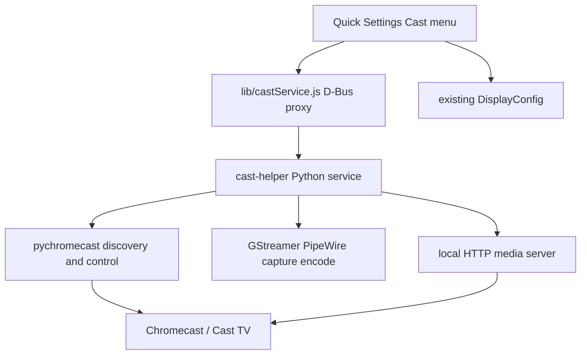

# Display & Cast — analysis and Phase 2 plan

## What the ideation got right

The prior tradeoff analysis is sound, and **Phase 1 of this repo already executed step 1 of that build order**.

| Ideation step | Status in [cast](file:///home/emm/projects/tools/cast) |
|---|---|
| Display extend / mirror / main / secondary + QS skeleton | **Done** — [`ui/displaysMenu.js`](ui/displaysMenu.js) + [`lib/displayConfig.js`](lib/displayConfig.js) |
| Presentation-mode toggle | **Done** — [`ui/presentationToggle.js`](ui/presentationToggle.js) + [`lib/presentationMode.js`](lib/presentationMode.js) |
| Clustered groups via logical monitors | **Done** — `buildCustomGroups` / Apply button when ≥3 monitors |
| Chromecast → DLNA → Miracast | **Not started** — branding/docs only |

Mutter’s logical-monitor model (one logical monitor holding many physical connectors) is exactly the right API for clustered mirroring; stock GNOME Settings never exposes it. That remains the product’s display-side differentiator. Do not rework it for casting.

## Protocol recommendation (first version)

**Target Chromecast first.** Keep the ideation order:

1. **Chromecast** — best device reach in EA / Kenya smart-TV market; mature Python stack (`pychromecast`); discovery is straightforward (`_googlecast._tcp`).
2. **DLNA** — almost free once a local media URL exists (same cast-URL pattern).
3. **Miracast last** — wrap [`gnome-network-displays`](https://gitlab.gnome.org/GNOME/gnome-network-displays) rather than reimplement WFD; flaky drivers, shrinking relevance.

Important correction to the ideation’s “thin D-Bus wrapper around pychromecast”: that wrapper cannot live *inside* the Shell extension. GJS cannot sanely own the Cast TLS protocol or a GStreamer encode pipeline. The extension must stay UI + orchestration; protocol work belongs in an **out-of-process session helper**.



## What already exists to build on

Keep these untouched as foundations:

- **QS placement** — [`extension.js`](extension.js) already uses `addExternalIndicator` (same top-right Quick Settings surface as Wi‑Fi / Bluetooth).
- **Display layouts** — Extend / Mirror all / Main only / Secondary only / custom groups.
- **Presentation mode** — idle/suspend inhibit + banner suppression; casting a live desktop should optionally auto-enable this.
- **Hotplug** — `MonitorsChanged` refresh pattern to mirror for cast-device list refresh.
- **GSettings** — extend the existing schema; no need for a new settings system.

Do **not** fold Cast into the Displays submenu. Displays = local layout; Cast = network sinks. Two tiles match the system’s mental model and keep the common 2-monitor layout path uncluttered.

## Phase 2 architecture (concrete)

### A. Session helper: `helpers/cast-helper/` (new)

Python 3 user service exposing a small D-Bus API on the session bus, e.g. `org.cast.tools.Cast1` at `/org/cast/tools/Cast1`.

Methods (minimal v1):

- `ListDevices() → a(sssb)` — id, name, model, online
- `Refresh()` — force mDNS rescan
- `CastDesktop(device_id, source)` — `source`: `"primary"` \| `"all"` \| connector name
- `CastFile(device_id, uri)` — optional stretch if cheap via pychromecast media controller
- `Stop()`
- Signals: `DevicesChanged`, `SessionChanged(status)`

Implementation sketch:

- Discovery/control: `pychromecast`
- Desktop mirror pipeline: PipeWire screen source → `x264enc`/`vah264enc` → fragmented MP4 or MPEG-TS → local HTTP (`aiohttp` or GStreamer `souphttpserver`) → `play_media(url)`
- Ship as `cast-helper.service` user unit + install script; extension detects missing helper and shows “Install cast helper” / disabled state rather than crashing

### B. Extension glue: `lib/castService.js` (new)

Same style as [`lib/displayConfig.js`](lib/displayConfig.js): `Gio.DBusProxy`, Promise wrappers, destroy/disconnect, try/catch + `[display-and-cast]` logging.

### C. UI: `ui/castMenu.js` (new)

New `QuickMenuToggle` titled **Cast**:

- Header + device list (name, status)
- Per-device actions: **Mirror screen**, **Stop**
- Empty state when helper missing or no devices
- Footer later: “Cast settings” if prefs appear

Wire in [`extension.js`](extension.js) beside Displays + Presentation:

```text
quickSettingsItems: [Displays, Cast, Presentation]
```

### D. Schema additions

In [`schemas/org.gnome.shell.extensions.display-and-cast.gschema.xml`](schemas/org.gnome.shell.extensions.display-and-cast.gschema.xml):

- `cast-auto-presentation` (`b`, default `true`) — turn on presentation mode while casting
- `last-cast-device` (`s`) — remember last sink id
- `cast-source` (`s`, default `"primary"`) — which screen to capture

### E. Integration with existing display features

When starting a desktop cast:

1. Optionally enable `PresentationMode` (reuse existing module).
2. Do **not** invent a fake Mutter monitor for Chromecast in v1 — Chromecast is a media sink, not a DRM connector. “Extend onto TV” via Cast is a later research item (virtual display / PipeWire portal complexity).
3. Local layout presets remain independent: user can Mirror/Extend physical monitors *and* cast primary content.

## Phase boundaries (keep scope honest)

**Phase 2 (this plan) — Chromecast MVP**

- Helper + D-Bus API
- Cast QS menu: discover, mirror primary (or all), stop
- Auto presentation-mode while casting
- README: helper install deps (`python3-pychromecast`, GStreamer plugins)

**Phase 3 — DLNA**

- Same helper process, add UPnP renderer backend; UI gains a protocol badge / filter
- Reuse HTTP URL pipeline unchanged

**Phase 4 — Miracast**

- Prefer launching/controlling `gnome-network-displays` (or its D-Bus if stable) from the Cast menu
- Do not reimplement WFD in-tree

**Explicit non-goals for Phase 2**

- prefs.js window
- Virtual monitor / “extend desktop onto Chromecast”
- AirPlay
- Replacing Displays grouping UX
- Permanent `ApplyMonitorsConfig` (keep verify→temporary)

## Small Phase 1 polish worth doing only if it blocks casting UX

Not required to start Phase 2, but cheap if touched anyway:

- User-visible error toast on layout/cast failure (today: console only)
- Secondary-only picker when >1 external (today: first non-main)

## Recommended implementation order

1. Scaffold `helpers/cast-helper` with `ListDevices` / `Refresh` only; verify from `gdbus` CLI.
2. Add `lib/castService.js` + Cast QS list UI (discovery-only).
3. Implement capture→HTTP→`play_media` for primary screen; wire Mirror + Stop.
4. Hook presentation-mode auto-toggle + schema keys.
5. Document helper install; pack helper path in README / optional zip extras.
6. Only after mirror is reliable: DLNA backend sharing the same URL.

## Why this is the best fit for *this* repo

- Phase 1 already delivered the hard GNOME UI + DisplayConfig differentiator the ideation described.
- Casting’s hard part is not Shell chrome — it is protocol + encode; isolating that in a helper keeps the extension unload-safe and debuggable.
- Chromecast-first maximizes real-world projector/TV utility for the named product (“Display & Cast”) without waiting on Miracast chipset luck.
- The local HTTP stream becomes the shared substrate for DLNA, so Phase 3 stays thin.
