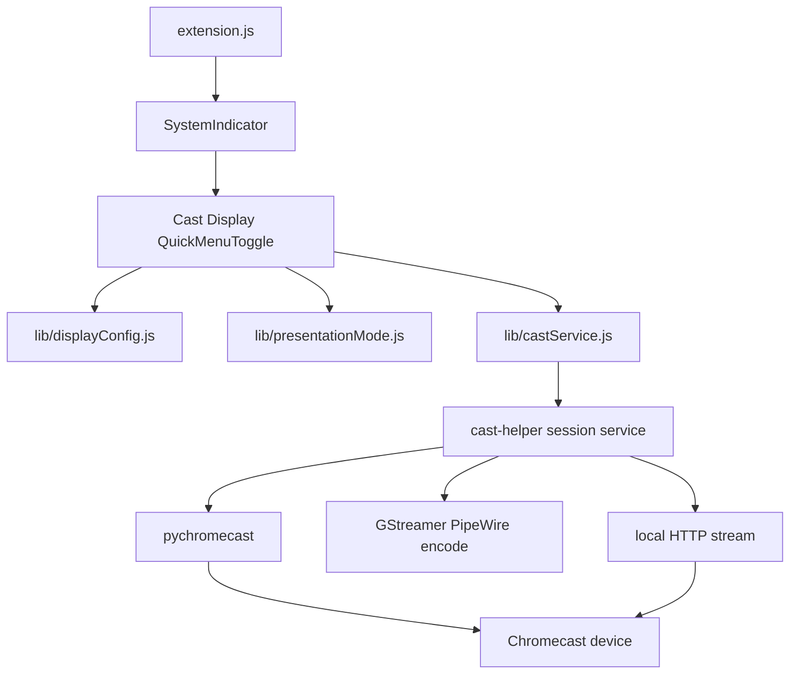

# Cast Display — Phase 2 plan (updated)

## Naming

| | Choice |
|---|---|
| **Visible name** | **Cast Display** (clearer than “Display & Cast”; fits one QS tile) |
| **UUID** | Keep `display-and-cast@cast.tools` so existing Phase 1 installs keep working |
| **Schema / gettext** | Keep `org.gnome.shell.extensions.display-and-cast` / `display-and-cast` |
| **metadata.json** | Update `name` + `description` only |

Alternatives considered and rejected: “Cast” (too vague vs Wi‑Fi Cast), “Displays” (hides casting), “Screen Cast” (sounds like GNOME’s built-in recorder).

## What Phase 1 actually shipped (clarify the “2 extensions” confusion)

There is already **one** GNOME Shell extension (`display-and-cast@cast.tools`). Phase 1 registered **two Quick Settings tiles** from that one extension:

1. **Displays** — layout presets + grouping ([`ui/displaysMenu.js`](ui/displaysMenu.js))
2. **Presentation mode** — separate toggle ([`ui/presentationToggle.js`](ui/presentationToggle.js))

Phase 2 keeps **one extension** and collapses those into **one Quick Settings entry**: **Cast Display**.

## Goal

One top-right Quick Settings menu that does everything end-to-end and works on Ubuntu Wayland:

- Local layouts: Extend / Mirror all / Main only / Secondary only / custom groups (3+)
- Presentation mode (switch inside the menu, not its own tile)
- Chromecast: discover devices, mirror the screen, stop casting
- Reliable helper lifecycle, visible errors, clean teardown

## Single-tile UX

Replace `[Displays] + [Presentation]` with one `QuickMenuToggle`:

```text
┌─ Cast Display ─────────────────────┐
│ Layout                             │
│  [Extend]      [Mirror all]        │
│  [Main only]   [Secondary only]    │
│ ─── (if 3+ monitors) ───────────── │
│ Custom grouping … [Apply]          │
│ ─────────────────────────────────  │
│ Presentation mode          [switch]│
│ ─────────────────────────────────  │
│ Cast to…                           │
│  Living Room TV     [Mirror]       │
│  Bedroom Chromecast [Mirror]       │
│  (or: Casting to Living Room… Stop)│
│  (or: Cast helper not running…)    │
│ ─────────────────────────────────  │
│ Display settings →                 │
└────────────────────────────────────┘
```

Tile behavior:

- **Title:** Cast Display
- **Subtitle:** `N displays` · when casting, `Casting to <name>` · when presentation-only, `Presentation`
- **Checked:** true while a cast session is active (primary “active” signal); presentation alone does not force checked
- **Icon:** `preferences-desktop-display-symbolic` (or `media-projector-symbolic` if available)

Implementation approach:

- Evolve [`ui/displaysMenu.js`](ui/displaysMenu.js) into the unified menu (or rename to `ui/castDisplayMenu.js` and update imports)
- Fold presentation into a `PopupSwitchMenuItem` (or compact row) calling existing [`lib/presentationMode.js`](lib/presentationMode.js)
- **Delete** the separate Presentation QS tile from [`extension.js`](extension.js) / [`ui/presentationToggle.js`](ui/presentationToggle.js) (file can go or become unused)
- Indicator still pushes **exactly one** `quickSettingsItems` entry



## Protocol order (unchanged)

1. **Chromecast first** — Phase 2
2. **DLNA** — Phase 3 (reuse HTTP URL)
3. **Miracast last** — Phase 4 (wrap gnome-network-displays)

## Architecture for casting that actually works

GJS cannot own Cast TLS or a durable encode pipeline. Casting stays in a **session helper**; the extension stays UI + D-Bus client.

### A. `helpers/cast-helper/` (new) — must be production-shaped, not a stub

Python 3 user service on the session bus: `org.cast.tools.Cast1` / `/org/cast/tools/Cast1`.

| Method / signal | Behavior |
|---|---|
| `ListDevices() → a(sssb)` | id, name, model, online |
| `Refresh()` | mDNS rescan |
| `CastDesktop(device_id, source)` | start mirror; `source`: `primary` \| `all` |
| `Stop()` | stop cast + tear down pipeline + free port |
| `GetStatus() → (siss)` | state, device_id, device_name, error |
| `DevicesChanged` / `SessionChanged` | push updates to QS |

**Working mirror pipeline (required for “actually functional”):**

1. Resolve Chromecast via `pychromecast` (connect, wait for ready, media controller).
2. Capture with GStreamer PipeWire (`pipewiresrc` / portal-aware path on Wayland). Prefer the **primary logical monitor** for v1.
3. Encode H.264 (`vah264enc` if VA-API present, else `x264enc tune=zerolatency`).
4. Serve a Chromecast-playable container (fragmented MP4 or MPEG-TS) on `127.0.0.1:<ephemeral>` **and** bind on the LAN IP the Cast device can reach (not localhost-only — Cast devices cannot fetch `127.0.0.1` on the PC).
5. `play_media(http://<lan-ip>:<port>/stream.mp4, content_type=...)`.
6. On `Stop` or helper exit: stop media on device, kill pipeline, close HTTP server, emit `SessionChanged`.

**Reliability requirements (Phase 2 exit criteria):**

- Helper installs as a **systemd --user** unit (`cast-helper.service`) with `Restart=on-failure`
- Extension calls `StartServiceByName` / documents `systemctl --user enable --now cast-helper.service`
- If helper missing: menu shows actionable empty state (“Install / start Cast helper”) — no Shell crash
- Firewall note in README (Cast + HTTP port); bind only when casting
- Audio out of scope for v1 video-only mirror (document clearly)
- Failures surface as QS subtitle or Shell notification toast (not journal-only)
- Idempotent `Stop()`; no orphan ffmpeg/gst processes after disable/logout

Ship: `helpers/cast-helper/` + `install-helper.sh` + `requirements.txt` (`pychromecast`, and system packages for GStreamer plugins).

### B. `lib/castService.js` (new)

Same patterns as [`lib/displayConfig.js`](lib/displayConfig.js): proxy, Promises, destroy, `[display-and-cast]` logging, reconnect on name-owner changes.

### C. Schema additions

In [`schemas/org.gnome.shell.extensions.display-and-cast.gschema.xml`](schemas/org.gnome.shell.extensions.display-and-cast.gschema.xml):

- `cast-auto-presentation` (`b`, default `true`)
- `last-cast-device` (`s`)
- `cast-source` (`s`, default `"primary"`)

When cast starts and auto-presentation is on → enable existing PresentationMode; on cast stop → restore prior presentation state (do not force-off if user had turned it on manually).

### D. Display features

Keep Mutter layout builders as-is. Do **not** invent a virtual DRM monitor for Chromecast in Phase 2. Layout and cast remain independent actions in the same menu.

## Phase boundaries

**Phase 2 (this plan)**

- Rename UI to **Cast Display**; one QS tile only
- Presentation switch inside that menu
- Chromecast discover + desktop mirror + stop that works on Ubuntu Wayland
- Helper install path + e2e verification checklist
- User-visible errors

**Phase 3 — DLNA** (same helper, same menu section)

**Phase 4 — Miracast** (external gnome-network-displays)

**Non-goals for Phase 2**

- prefs.js
- Virtual “extend onto TV”
- AirPlay / audio cast
- Third QS tile
- Permanent ApplyMonitorsConfig (keep verify→temporary)
- Renaming UUID (breaks installs)

## Implementation order

1. **Consolidate UI + rename** — one Cast Display menu; presentation switch inside; drop second tile; update metadata name/description/README.
2. **Helper scaffold** — D-Bus + ListDevices/Refresh; verify with `gdbus`.
3. **Wire discovery into menu** — Cast to… list; missing-helper state.
4. **Desktop mirror pipeline** — LAN-reachable HTTP + play_media; Stop teardown; status signals.
5. **Auto-presentation + toasts + schema**.
6. **Install script + README + e2e checklist** (two displays layout, presentation switch, cast discover/mirror/stop).

## Success criteria

- After enable + login: **exactly one** Cast Display tile in Quick Settings
- Layout buttons and grouping behave as in Phase 1
- Presentation switch inhibits idle/suspend and suppresses banners
- On a LAN with a Chromecast-capable TV: devices appear; Mirror shows the desktop on the TV; Stop returns both ends to idle
- Disabling the extension stops any active cast and leaves no helper orphans beyond the user unit’s normal stopped/running state
