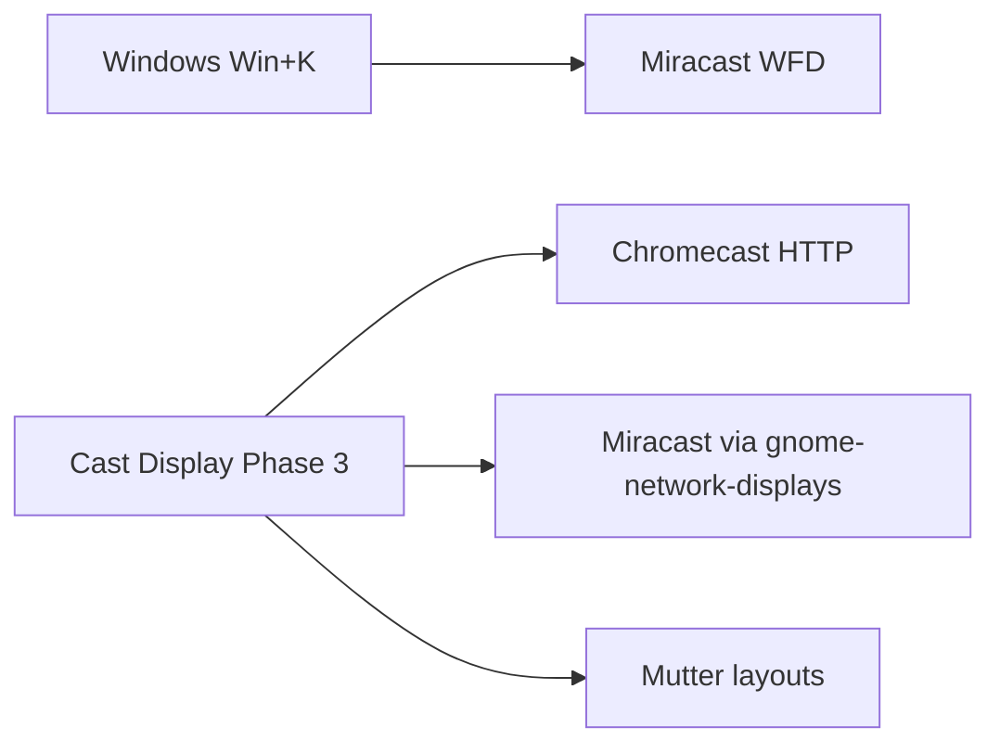

# Cast Display — Phase 3 plan

## Context from deep audit

Phase 2 is implemented in-tree: one **Cast Display** QS tile, Mutter layouts, presentation mode, Chromecast helper (`org.cast.tools.Cast1`). Gaps that block a polished product:

- Stale zip / no tags; `__pycache__` tracked; unused helper unit templates diverge from what [`install-helper.sh`](install-helper.sh) generates
- Windows Cast (Win+K) is **Miracast** wireless display — not Chromecast; current stack only covers Cast TVs
- Cast UX is still “Refresh then Mirror”; `last-cast-device` is write-only; portal every time; no one-shot install
- Bugs: GST→ffmpeg PipeWire **fd double-close** on fallback; ffmpeg `-listen 1` fragility

## Protocol reality (locked decision)

| Windows behavior | Linux Phase 3 approach |
|---|---|
| Open Cast → auto scan | Open Cast Display menu → auto `Refresh` + background discovery |
| Click device → connect | One **Connect** action (Chromecast mirror or Miracast session) |
| Duplicate / Extend / Second screen | Keep existing layout presets; after connect offer status; Miracast is mirror-like (GND) |
| Miracast receivers | Soft-dep: discover/control via **gnome-network-displays** when installed |
| Smart TVs (Cast) | Keep existing Chromecast path |

**Not in Phase 3:** DLNA (moves to Phase 4), AirPlay, audio cast, virtual “extend onto Chromecast”, rewriting WFD in-tree.

## 1–2. Cleanup (codebase hygiene)

- Remove from git / ignore: `helpers/cast-helper/__pycache__/`, regenerate ignore rules (`__pycache__/`, `*.pyc`)
- Delete stale on-disk `display-and-cast@cast.tools.shell-extension.zip` (gitignored) after rebuilding, or stop shipping it in repo
- Align or remove unused templates: either make [`helpers/cast-helper/cast-helper.service`](helpers/cast-helper/cast-helper.service) the single source of truth that `install.sh` installs (substitute paths), or delete templates and keep generation only in install script — **use template + `envsubst`/`sed` from install** so one file is maintained
- Fix stylesheet Phase 1 comment; bump [`metadata.json`](metadata.json) `version` to **3** and description to mention wireless display + Chromecast
- Fix [`cast_helper.py`](helpers/cast-helper/cast_helper.py) `StreamPipeline.start()`: on GST failure, **do not** `stop()` in a way that closes the portal FD before ffmpeg reuse — transfer ownership cleanly
- Prefer multi-client HTTP serve for ffmpeg path (replace `-listen 1` with a small threaded HTTP server feeding MPEG-TS, or `hlssink`/`mpegts` over a persistent `aiohttp`/`http.server` wrapper) so Chromecast probe reconnects do not kill the stream

## 3. Windows-like Cast UX + Miracast

### Chromecast UX (Win+K feel)

In [`ui/castDisplayMenu.js`](ui/castDisplayMenu.js) + [`lib/castService.js`](lib/castService.js) + helper:

- On menu **open**: auto-start helper + `Refresh` (show “Searching for displays…” while scanning)
- Rename primary action **Mirror → Connect**; show **Disconnect** when active
- Use `last-cast-device`: highlight last device; optional “Reconnect” row at top when idle
- Continuous discovery in helper (periodic mDNS / CastBrowser) emitting `DevicesChanged` — UI Refresh becomes secondary
- Clear empty states: no helper / no devices / casting error (toasts already exist — keep)

### Miracast (true Windows protocol)

- Depend softly on **`gnome-network-displays`** (document `sudo apt install gnome-network-displays`)
- Extend helper D-Bus API:
  - `ListDevices` gains protocol field **or** add `ListWirelessDisplays()` returning unified list with `protocol`: `chromecast` | `miracast`
  - Prefer extending to `a(ssssb)` = id, name, model, protocol, online (update JS proxy accordingly)
- Miracast connect: launch/control GND (CLI/D-Bus if available; otherwise `gio launch` / desktop file + documented manual confirm). Prefer any stable D-Bus API GND exposes; if none, spawn GND focused on device selection and surface status in QS
- UI: single **Cast to…** list with protocol badge (`Cast` / `Wireless display`)

Layout buttons remain independent (Windows separates Win+K cast from Win+P project modes; we already have project-like presets).

## 4. Packaging (recommended approach)

**Best for this project:** one **`./install.sh`** “clone and go” installer + **GitHub Release** assets. Not Flatpak (GNOME Shell extensions run in the host Shell; Flatpak is a poor fit). Not required `.deb` for v3 (can be Phase 4).

`install.sh` will:

1. Check Wayland/GNOME Shell 45+
2. `glib-compile-schemas schemas/`
3. Symlink or copy extension to `~/.local/share/gnome-shell/extensions/display-and-cast@cast.tools`
4. Install helper (merge current [`install-helper.sh`](install-helper.sh)): apt deps if interactive, venv, systemd user unit, D-Bus activation, `enable --now`
5. Soft-check `gnome-network-displays`; print install hint if missing
6. `gnome-extensions enable …` and print “log out to finish”

Also add `Makefile` targets: `make install`, `make pack`, `make uninstall`.

`make pack` → fresh `gnome-extensions pack` with `lib`, `ui`, `helpers`, `install.sh`, `README.md`.

Keep `install-helper.sh` as a thin wrapper calling `install.sh --helper-only` **or** fold into `install.sh` and remove the old script (prefer fold + one entrypoint).

## 5. Release and tag

After code lands on `main`:

1. Commit Phase 3 (user-facing message)
2. Tag **`v3.0.0`**
3. `gh release create v3.0.0` with:
   - `display-and-cast@cast.tools.shell-extension.zip`
   - notes: install via `./install.sh` or zip + helper; Chromecast + Miracast (GND); known limits (audio, portal, Wi‑Fi)
4. Push tag + release to `origin` (`https://github.com/MatoloJr/cast.git`)

## 6. Enhancement backlog (document in README; do not build all now)

- Audio in mirror stream (PipeWire audio + AAC/Opus)
- Persist portal restore token / fewer prompts
- True Extend-to-wireless (virtual monitor) research
- DLNA/UPnP renderers
- Prefs UI (bitrate, source primary/all, auto-reconnect)
- Keyboard shortcut akin to Win+K
- i18n (`po/`)
- CI: pack + schema compile on PR
- extensions.gnome.org listing
- Optional `.deb` / COPR later

## 7. README rewrite

Replace Phase-2-centric docs with a full product README:

- What it is / who it’s for
- Features (layouts, presentation, Chromecast, Miracast)
- How it compares to Windows Cast (Win+K)
- Architecture diagram (extension + helper + protocols)
- Requirements
- **Quick start:** `git clone … && ./install.sh`
- Zip / Release install
- Usage (Connect, Disconnect, layouts, presentation)
- Troubleshooting (firewall, guest Wi‑Fi, portal, GND, logs)
- Uninstall
- Development / packing / releasing
- Roadmap (Phase 4+)
- License (add if missing; default MIT if repo has none — check and set)

## Implementation order

1. Hygiene + fd/HTTP fixes + metadata v3  
2. Unified device list API + continuous discovery + Connect/Reconnect UX  
3. Miracast via gnome-network-displays integration  
4. `install.sh` + Makefile + fold helper install  
5. Comprehensive README  
6. `make pack`, tag `v3.0.0`, `gh release create`

## Success criteria

- Clean tree: no tracked pycache; one install entrypoint; fresh zip from current sources  
- Open Cast Display → devices appear without manual Refresh in the common case  
- Connect to Chromecast works; Miracast devices appear when GND is installed  
- `./install.sh` from a clone yields a working extension + helper after logout/login  
- GitHub `v3.0.0` release exists with zip + notes  
- README documents product, Windows comparison, install, troubleshoot, roadmap  
