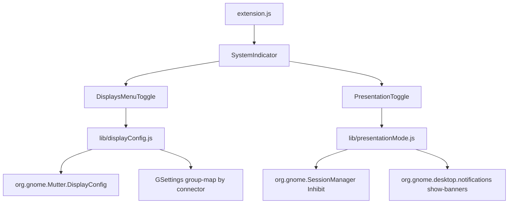

# Displays Quick Settings Extension (Phase 1)

## Target

Greenfield extension in `/home/emm/projects/tools/cast`, installable on this machine (**GNOME Shell 50.1**, Wayland). UUID: `display-and-cast@cast.tools`. `shell-version`: `["45","46","47","48","49","50"]` (ESM required; pre-45 not supported).

## Layout

```text
display-and-cast@cast.tools/   (repo root = extension root for symlink install)
├── metadata.json
├── extension.js                 # Extension class, enable/disable wiring
├── stylesheet.css               # Compact action grid + monitor tiles
├── README.md
├── lib/
│   ├── displayConfig.js         # Mutter DisplayConfig proxy + layout builders
│   └── presentationMode.js      # SessionManager inhibit + DND restore
├── ui/
│   ├── displaysMenu.js          # QuickMenuToggle: 2x2 actions + grouping
│   └── presentationToggle.js    # QuickToggle for presentation mode
└── schemas/
    └── org.gnome.shell.extensions.display-and-cast.gschema.xml
```

No `prefs.js` in Phase 1 (schema used only for internal persistence).

## Architecture



## Core modules

### [`lib/displayConfig.js`](lib/displayConfig.js)

Wrap `Gio.DBusProxy` for `org.gnome.Mutter.DisplayConfig` at `/org/gnome/Mutter/DisplayConfig`:

- `getCurrentState()` → `{ serial, monitors, logicalMonitors, properties }` with helpers:
  - connector, `display-name`, `is-builtin`, current `mode_id`, mode width/height, scale from current logical assignment (fallback 1.0)
- `applyLogicalMonitors(logicalMonitors, method=1)` refresh serial, optional `method=0` verify then `method=1` temporary; pass through `layout-mode` if present
- Layout builders (apply monitor entry = `(connector, mode_id, {})`):
  - **Extend**: one logical monitor per physical, primary on builtin (else first), `x` stepped by logical width (`width / scale` when `layout-mode === 1`)
  - **Mirror all**: single logical monitor listing every connector (each keeps its current mode_id)
  - **Main only**: builtin if any, else current primary connector; omit others
  - **Secondary only**: first non-main connector only; if none, no-op with logged warning
  - **Custom groups**: one logical monitor per used group letter; monitors in group share that logical; groups laid out left-to-right non-overlapping
- `connectMonitorsChanged(cb)` / disconnect on destroy
- Every call in try/catch; async via `call`/`await` Promises (no unhandled rejections)

**Apply method default:** verify (`0`) then temporary (`1`) so layouts are live but do not rewrite `~/.config/monitors.xml` until the user confirms in GNOME Settings if desired.

### [`lib/presentationMode.js`](lib/presentationMode.js)

- Inhibit via `org.gnome.SessionManager.Inhibit(app_id, 0, 'Presentation mode', 4|8)` → store cookie; `Uninhibit` on off/disable
- DND: save then set `org.gnome.desktop.notifications` `show-banners` to `false`; restore saved value on off (do not force `true` if DND was already on)
- Persist presentation enabled in extension GSettings so Shell restart can re-enable cleanly from `enable()` and always tear down in `disable()` even if partially initialized

### UI ([`ui/displaysMenu.js`](ui/displaysMenu.js), [`ui/presentationToggle.js`](ui/presentationToggle.js))

- `DisplaysIndicator` extends `QuickSettings.SystemIndicator`; push both items; `Main.panel.statusArea.quickSettings.addExternalIndicator(...)`
- **Displays** = `QuickMenuToggle` (`toggleMode: false`, title `"Displays"`, icon `preferences-desktop-display-symbolic`):
  - Menu header + compact **2×2** `St.Button` grid: Extend / Mirror all / Main only / Secondary only (sentence case)
  - If `monitors.length >= 3`: show tile grid (one tile per connector, label = display-name or connector); click cycles group `A → B → C → …` wrapping at monitor count; colored border/badge via CSS classes `.group-a` …; **Apply** button commits grouping via DisplayConfig and saves map to GSettings
  - Hide grouping section when &lt; 3 monitors; rebuild on `MonitorsChanged`
- **Presentation mode** = separate `QuickToggle` (`toggleMode: true`), synced to presentation module state

### Persistence ([`schemas/...gschema.xml`](schemas/org.gnome.shell.extensions.display-and-cast.gschema.xml))

| Key | Type | Purpose |
|-----|------|---------|
| `monitor-groups` | `s` (JSON) | `{ "HDMI-1": "A", "DP-1": "B", ... }` keyed by connector |
| `presentation-mode` | `b` | Last toggle state for restore after Shell restart |

Compile schema locally for install (`glib-compile-schemas schemas/`).

### Lifecycle ([`extension.js`](extension.js))

```js
enable() {
  this._displayConfig = new DisplayConfig();
  this._presentation = new PresentationMode(this);
  this._indicator = new DisplaysIndicator(this, this._displayConfig, this._presentation);
  Main.panel.statusArea.quickSettings.addExternalIndicator(this._indicator);
  // if settings presentation-mode true → enable again
}
disable() {
  try { this._presentation?.disable(); } catch (_) {}
  try { this._displayConfig?.destroy(); } catch (_) {}
  try { this._indicator?.destroy(); } catch (_) {}
  // null all refs
}
```

On hotplug: refresh menu UI; for connectors present in `monitor-groups`, keep assignments; drop missing connectors from the in-memory map (keep schema entries for reconnect).

## Styling ([`stylesheet.css`](stylesheet.css))

Compact action grid and monitor tiles only reuse Quick Settings look; no custom card chrome. Group colors as subtle borders/badges. Avoid private CSS class names that broke in Shell 48 (`quick-menu-toggle` renames); style only our custom classes.

## README

Install via symlink into `~/.local/share/gnome-shell/extensions/display-and-cast@cast.tools`, `glib-compile-schemas`, `gnome-extensions enable`, Wayland note (log out/in; `Alt+F2` `r` is X11-only) and `journalctl -f -o cat /usr/bin/gnome-shell` for logs.

## Defaults locked in

- Main = `is-builtin` monitor, else current primary connector
- Secondary = first non-main connected monitor (others disabled in "Secondary only")
- Apply = verify then temporary
- Groups cycle A… through letter count = number of monitors; default assignment after hotplug = restore saved map, else one group per monitor (extend-like)
- No casting stubs, no prefs window
